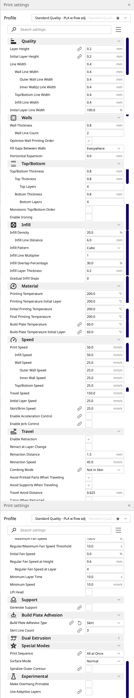
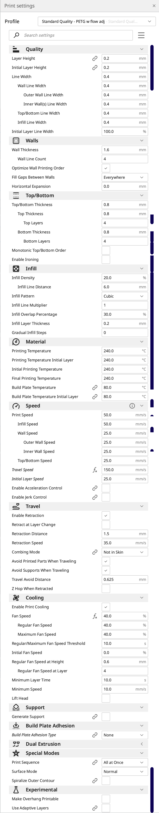
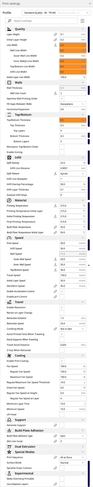

<div align="center">
<h1>KP3S MARLIN 3D TOUCH MARLIN</h1>

<p>Guide for the KP3S, this guide provide the neccessary information, for setting up a kp3s with marlin firmware and a 3d touch leveling sensor.

</p>
</div>

## About
<p>
<b>Many thanks to <a href="https://github.com/bdwilson/KP3S">bdwilson</a> for make all this possible.</b></p>


After many tries and errors I was able to set my kp3s 3d printer to work properly with the 3d touch sensor, I hope this guide help you to achieve it too!.

## Clone this repository

```bash
git clone 
```

All of the necessary files nedded are contained here.

## Print 3d Touch Mount

The directory with the name stls containes **3** files one of them is the bed level test you can use this file at the end of the guide and check if your printer is working correctly, the other **2** files are the for mounting the 3d touchsensor , I printed them using PLA with 20 percent infill.

<p>The Kingroon team made a <a href="https://www.youtube.com/watch?v=s2ZiibBKVKI">video</a> to help you with the instalation of the sensor, you can stop watching the video after min 6:41.</p>

## Marlin Firmware

**KP3S with Titan metal enclosure, 3d touch mounted on right of extruder**

This is the 2.1.1 marlin version.


<p>Format your SDcard using <b>fat32</b> , then copy the <b>Robin_nano.bin</b> located inside of the <b>marlin_2.1.1</b> directory.</p>

<p>If your printer is ON turn it OFF, plug the SDcard, and turn ON again, once marlin is installed, reset the EEPROM.</p>

## Reset EEPROM

1. Configuration
1. Advance Settings
1. **Initialize EEPROM**

## Bed Tramming Wizard

**First increase the bed temperature to 60**

<p>Level your bed using the bed tramming wizard.</p>

1. Motion
1. **Tramming Wizard**

## Z probe offset wizard

<p>To fix the Z offset use the Z probe offset wizard.</p>

**First increase the bed temperature to 60 and tool temperature to 150, once the temperature has been changed.**

1. Configuration
1. Advance Settings
1. Probe offsets
1. **Z probe Wizard**

## Store Settings

1. Configuration
1. **Store Settings**

## Level Bed

**Increase the bed temperature to 60**

1. Motion
1. Bed Leveling
1. **Level bed**

## Printer Error

If for some reason your printer stop working and the display shows an error, is probably because octoprint is connected to the printer, **all 
of the previous steps should be done with out having octoprint connected**.

## Octoprint Settings

**GCODE Settings**

**After print job is cancelled**

```
G91 ; set to Relative position
G1 E-1 F300 ; retract filament a bit before lifting nozzle
G0 Z15 ; move z axis up 15mm
G90 ; set to Absolute position
G0 X150Y150; move part out for inspection
M104 S0; turn off extruder heat
M140 S0; turn off heated bed
M106 S0; Turn off fan
M84; Move Freely
```

**After print job is paused**

```
; Reference: https://www.yirco.me/octoprint-pause-change-filament/

; relative XYZE
G91
M83
; retract filament of 0.8 mm up, move Z slightly upwards and
G1 Z+5 E-0.8 F4500
; absolute XYZE
M82
G90
; move to a safe rest position, adjust as necessary
G1 X170 Y170
; try locking motors
M17 XY 
; disable stepper timeout
M84 S0

```

**Before print job is resumed**

```
; Reference: https://www.yirco.me/octoprint-pause-change-filament/

; relative extruder
M83
; reset stepper timeout to 120 secs
M84 S120

; prime nozzle
G1 E-0.8 F4500
G1 E0.8 F4500
G1 E0.8 F4500

; absolute E
M82

; absolute XYZ
G90

; reset E
G92 E{{ pause_position.e }}

; WARNING!!! - use M83 or M82(exruder absolute mode) according what your slicer generates
; If you use Cura, this will be M82, otherwise, likely its M83
; For more comments/info, see https://www.yirco.me/octoprint-pause-change-filament/
M82 ; extruder relative mode

; move back to pause position XYZ
G1 X{{ pause_position.x }} Y{{ pause_position.y }} Z{{ pause_position.z }} F4500

; reset to feed rate before pause if available
G1 F{{ pause_position.f }}

```

## Cura Settings

**Add a new machine.**

1. Settings
1. Printer
1. Add Printer
1. Add a non-networked printer
1. Creality 
1. Creality Ender 3


**MAKE THIS CHANGES.**

**X (Width)  180mm**

**Y (Depth)  180mm**

**Z (Height) 180mm**


**Start GCODE**

```
; Ender 3 Custom Start G-code
M501 ; load EEPROM settings
G92 E0 ; Reset Extruder
G28 ; Home all axes
G1 Z2.0 F3000 ; Move Z Axis up little to prevent scratching of Heat Bed
G1 X0.1 Y20 Z0.3 F5000.0 ; Move to start position
G1 X0.1 Y100.0 Z0.3 F1500.0 E15 ; Draw the first line
G1 X0.2 Y100.0 Z0.3 F5000.0 ; Move to side a little
G1 X0.2 Y20 Z0.3 F1500.0 E30 ; Draw the second line
G92 E0 ; Reset Extruder
; M501 ; Restore settings from EEPROM
; M420 S1 ; Load bed leveling data if you have BL touch; use G29 if you would 
; rather level 
G1 Z2.0 F3000 ; Move Z Axis up little to prevent scratching of Heat Bed
G1 X5 Y20 Z0.3 F5000.0 ; Move over to prevent blob squish
```

**Stop GCODE**

```
; KP3S changes were Y150 (don't move up as much as Ender)
G91 ;Relative positioning
G1 E-2 F2700 ;Retract a bit
G1 E-2 Z0.2 F2400 ;Retract and raise Z
G1 X5 Y5 F3000 ;Wipe out
G1 Z10 ;Raise Z more
G90 ;Absolute positionning
G1 X0 Y170 ;Present print
M106 S0 ;Turn-off fan
M104 S0 ;Turn-off hotend
M140 S0 ;Turn-off bed
M84 X Y E ;Disable all steppers but Z
```

<div align="center">
<h2>Cura suggested settings for PLA</h2>
</div>


<div align="center">

</div>

<div align="center">
<h2>Cura suggested settings for PETG </h2>
</div>


<div align="center">

</div>


<div align="center">
<h2>Cura suggested settings for TPU</h2>
</div>

<div align="center" size="200">

</div>

If you find this guide useful please give it a star and share.
